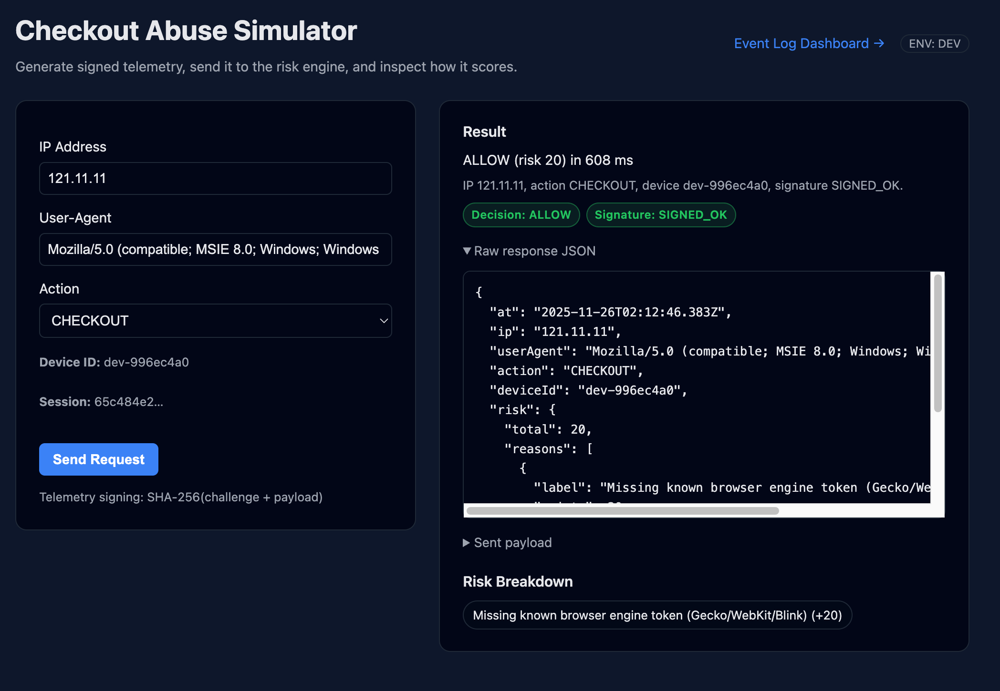
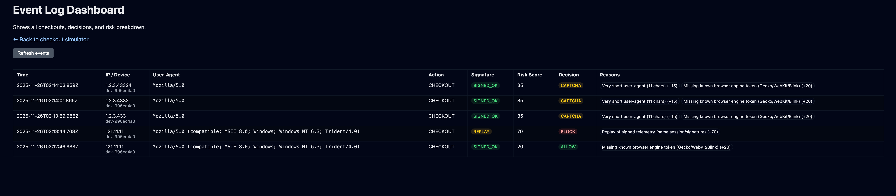

# 🚦 Checkout Abuse Simulator

A compact, production-style **anti-bot** and **abuse-detection** engine.

This project recreates the core pipeline used by large platforms (Google, Meta, Stripe) to detect automated abuse during checkout/login flows.
It demonstrates: **signed telemetry**, **risk scoring**, **velocity rules**, **device correlation**, **UA integrity checks**, and a **real-time analyst dashboard**.

---

# 🖼️ UI Preview

### **Simulator UI (signed telemetry → scoring → decision)**



### **Event Log Dashboard (real-time analyst tooling)**



---

# 🔍 What it does

* **Cryptographically signed telemetry**
  Detects tampering + replay (`SIGNED_OK`, `TAMPERED`, `REPLAY`, `UNSIGNED`)

* **Config-driven risk engine**
  Weighted rules (UA anomalies, headless signals, velocity bursts, correlation patterns)

* **Velocity & correlation detection**
  Flags: high IP/device request rates, device hopping across IPs, shared IP “farms”

* **Browser integrity signals**
  Missing engine tokens, suspicious renderers, mismatched platform/device traits

* **Analyst Dashboard**
  Real-time visibility into risk, decisions, signatures, and request context

* **Polished internal-tool UI**
  Modeled after abuse/fraud consoles used at FAANG companies

---

# 🧠 Architecture

```
public/index.html      → Simulator (signed telemetry)
public/events.html     → Analyst dashboard

backend/api/*          → Routes (checkout, session, dashboard)
backend/risk/*         → Risk engine, rule config, signals
backend/storage/*      → Event log + replay cache
backend/index.ts       → Express server
```

Pipeline:
**simulate → sign → verify → score → decide → log → review**

---

# 🚀 Running locally

```bash
npm install
npm run dev
```

* Simulator → [http://localhost:3001](http://localhost:3001)
* Dashboard → [http://localhost:3001/events.html](http://localhost:3001/events.html)

---

# 🧪 Example scenarios

* **Normal browser** → ALLOW
* **curl / Python UA** → BLOCK
* **Proxy hopping (1 device, many IPs)** → BLOCK / SHADOW_BAN
* **Replay attack** → signatureStatus = REPLAY

---

# 🎯 Purpose

This project showcases **real-world abuse engineering**:
risk modeling, adversarial behavior analysis, signal design, integrity enforcement, and analyst-facing tooling.

Skills relevant to teams in:

* Anti-Abuse / Integrity Engineering
* Bot Detection
* Fraud/Risk
* Trust & Safety
* Platform Security
